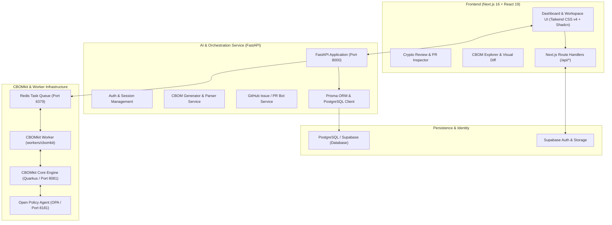

# QShieldX 🛡️
### Enterprise Post-Quantum Cryptography (PQC) Security Management & CBOM Platform

[](https://nextjs.org/)
[](https://react.dev/)
[](https://fastapi.tiangolo.com/)
[](https://tailwindcss.com/)
[](https://cyclonedx.org/)
[](https://csrc.nist.gov/pqc)
[](LICENSE)

---

## 📌 Overview

**QShieldX** is an enterprise-grade cryptographic security platform designed to discover, audit, monitor, and modernize cryptographic assets across source code, containerized environments, and cloud infrastructure.

As organizations prepare for the advent of **Cryptographically Relevant Quantum Computers (CRQCs)** and defend against **Harvest Now, Decrypt Later (HNDL)** adversaries, QShieldX delivers automated **Cryptographic Bill of Materials (CBOM)** generation, quantum risk posture scoring, migration roadmap planning, and automated PR review integrations (CodeRabbit-style cryptographic audits) aligned with NIST standards (**FIPS 203 ML-KEM**, **FIPS 204 ML-DSA**, and **FIPS 205 SLH-DSA**).

---

## 🚀 Key Capabilities

- **Automated CBOM Generation (CycloneDX 1.7)**: Discovers algorithms, key lengths, certificates, encryption modes, and padding schemes from source code and binaries.
- **Quantum Risk Scoring & Timeline**: Quantifies cryptographic exposure against Shor's and Grover's quantum threat algorithms, highlighting vulnerable RSA, ECC, and legacy cipher usage.
- **Crypto Review for Pull Requests**: Automated, developer-first PR reviews inspecting cryptographic AST diffs, tracking CBOM delta changes, and suggesting quantum-safe remediation patches.
- **Multi-Cloud & Git Integrations**: Connects seamlessly with GitHub, GitLab, and enterprise repositories, listening to webhooks and generating pull request comments and GitHub issues.
- **Post-Quantum Migration Planner**: Interactive guidance to modernize legacy asymmetric cryptography to NIST-standardized algorithms (ML-DSA, ML-KEM, SLH-DSA).
- **Cryptographic Digital Twin & Network Topology**: Visual interactive dependency graph of all cryptographic assets, cipher suites, and TLS terminations.

---

## 🏗️ Architecture & Tech Stack



### Technology Breakdown

| Layer | Technologies |
|---|---|
| **Frontend** | Next.js 16.1.7 (App Router, Turbopack), React 19, TypeScript 5.9, Tailwind CSS v4, Shadcn UI, Radix UI Primitives, Lucide Icons, Recharts, @xyflow/react |
| **Backend API** | FastAPI, Python 3.13 / 3.14, Uvicorn, Pydantic v2, Prisma Client Python, GitPython |
| **CBOM Engine** | CBOMkit (Quarkus / Java 21), CycloneDX 1.7 specification, Open Policy Agent (OPA) |
| **Queue & Cache** | Redis 7 (`jobs:cbomkit`, `results:cbomkit`) |
| **Database & Auth**| PostgreSQL 16, Supabase Auth (`@supabase/ssr`, `@supabase/supabase-js`) |
| **Containerization**| Docker, Docker Compose |

---

## 📁 Repository Directory Structure

```text
d:\qshieldx\
├── ai_service_demo/            # FastAPI backend services and business logic
│   ├── database/               # Prisma client and schema definition
│   │   ├── client.py           # Prisma singleton connection manager
│   │   └── schema.prisma       # Database schema (User, Project, Repository, CBOM)
│   ├── models/                 # Domain models and response formatters
│   ├── routes/                 # FastAPI API route modules
│   │   ├── auth.py             # Authentication endpoints (/auth/register, /auth/login, /auth/me)
│   │   ├── cbom.py             # CBOM trigger and compliance endpoint (/cbom)
│   │   ├── issue.py            # Automated GitHub vulnerability issue creation (/make_isse)
│   │   ├── projects.py         # Project workspace management (/projects)
│   │   └── repository.py       # Monitored repository configuration
│   ├── schemas/                # Pydantic validation schemas
│   ├── services/               # Core business services (cbom, auth, issue, project, repo)
│   └── .env                    # Backend environment configuration
│
├── app/                        # Application entrypoint package
│   └── app.py                  # FastAPI root application instance & lifespan setup
│
├── common/                     # Shared Python utilities and domain models
│   ├── cbom_analysis.py        # CBOM component parsing, minimization & matching
│   ├── cbom_filters.py         # Cryptographic asset type filters
│   ├── config.py               # Shared settings (Redis, GitHub Token, Workers)
│   ├── models.py               # Dataclass definitions (RepoInfo, JobInstruction, JobResult)
│   ├── utils.py                # Git clone, URL parsers, JSON normalization helpers
│   └── worker.py               # Generic Redis worker consumer loop and runner
│
├── docker/                     # Docker configurations & container manifests
│   ├── docker-compose-cbomkit.yml # CBOMkit engine, OPA, PostgreSQL, and viewer
│   ├── Dockerfile.worker-cbomkit  # Containerized CBOMkit worker image
│   └── env/                    # Environment files for containers
│
├── frontend/                   # Next.js 16 Web Dashboard Application
│   ├── app/                    # App Router pages & API routes
│   │   ├── (auth)/             # Login and register pages
│   │   ├── cbom/               # CBOM explorer, viewer, and raw CycloneDX JSON viewer
│   │   ├── crypto-review/      # PR review dashboard, webhook onboarding & detail views
│   │   │   └── pr/[id]/        # Individual PR crypto diff, findings, and fix generator
│   │   ├── intelligence/       # Vulnerability intelligence and threat feeds
│   │   ├── projects/           # Projects hub & workspace switcher
│   │   ├── quantum-risk/       # Quantum risk heatmaps and Shor's exposure timeline
│   │   ├── targets/            # Discovery target pipeline and asset wizard (/targets/new)
│   │   ├── topology/           # Cryptographic infrastructure topology graph
│   │   └── api/                # Next.js API route handlers (targets, agent, etc.)
│   ├── components/             # Reusable UI component library (Shadcn + Radix)
│   │   ├── app-sidebar.tsx     # Collapsible navigation rail & platform menu
│   │   └── ui/                 # Buttons, cards, dialogs, badges, tables, sliders
│   └── package.json            # Node.js dependencies and build scripts
│
├── workers/                    # Distributed background workers
│   └── cbomkit/                # CBOMkit WebSocket consumer & task processor
│       ├── entrypoint.sh       # Container startup script
│       └── main.py             # CbomKitClient and Redis queue runner
│
├── backendstartup.sh           # Automated backend startup script (Docker + Compose)
├── docker-compose.yml          # Root API service orchestration
├── pyproject.toml              # Python project metadata and dependencies
└── pnpm-workspace.yaml         # Node.js workspace configuration
```

---

## 🛠️ Step-by-Step Setup Guide

### 1. Prerequisites

Ensure you have the following installed on your host system:

- **Git** (2.40+)
- **Docker Desktop** (Engine 24.0+ with Docker Compose v2)
- **Node.js** (v20.x or v22.x LTS)
- **pnpm** (v10+ recommended: `corepack enable && corepack prepare pnpm@latest --activate`)
- **Python** (v3.13 or v3.14) with `uv` or `pip`

---

### 2. Environment Variables Configuration

Create the necessary configuration files before launching services.

#### A. Backend Environment: `ai_service_demo/.env`
```ini
# GitHub Integration
GITHUB_TOKEN=your_github_personal_access_token
GITHUB_OWNER=your_github_username_or_org
GITHUB_REPO=your_default_repo
GITHUB_CACHE_TTL_SEC=86400

# Redis Queue Connection
REDIS_HOST=localhost
REDIS_PORT=6379

# Worker Configuration
AVAILABLE_WORKERS=cbomkit
AVAILABLE_LANGUAGES=python,java,javascript,go,rust

# Supabase / Database Connection
DATABASE_URL="postgresql://postgres:[PASSWORD]@[HOST]:6543/postgres?pgbouncer=true"
DIRECT_URL="postgresql://postgres:[PASSWORD]@[HOST]:5432/postgres"

# CBOMkit Engine URL
CBOMKIT_BASE_URL=http://localhost:8081
```

#### B. Frontend Environment: `frontend/.env.local`
```ini
NEXT_PUBLIC_SUPABASE_URL=https://your-project.supabase.co
NEXT_PUBLIC_SUPABASE_ANON_KEY=your-supabase-anon-key
NEXT_PUBLIC_API_URL=http://localhost:8000
```

---

### 3. Starting Backend Services

#### Option 1: Automated Script (Recommended)
From the repository root, execute the provided startup script:
```bash
bash backendstartup.sh
```
This script will:
1. Load environment variables from `ai_service_demo/.env`.
2. Start Docker containers for **CBOMkit Backend (8081)**, **OPA Policy Agent (8181)**, and **PostgreSQL (5432)**.
3. Start the **FastAPI Backend (8000)** container with live-reload mounting.

#### Option 2: Manual Docker Compose
```bash
# 1. Start CBOMkit and Supporting Databases
cd docker
docker compose -f docker-compose-cbomkit.yml --profile prod up -d
cd ..

# 2. Start Redis (if not running)
docker run -d --name qshieldx-redis -p 6379:6379 redis:7-alpine

# 3. Start the FastAPI API Service
docker compose up -d
```

---

### 4. Running the Frontend Dashboard

Open a separate terminal window and run:

```bash
# Navigate to the frontend directory
cd frontend

# Install dependencies
pnpm install

# Start Next.js development server
pnpm dev
```

The frontend dashboard will be available at: **`http://localhost:3000`**

---

## 🌐 Application Routes & Endpoints Reference

### 1. Frontend Pages (`http://localhost:3000`)

| Route | Page Name | Description & Capabilities |
|---|---|---|
| `/` | **Overview Dashboard** | Overall cryptographic health, quantum risk index, algorithm distribution, and active alerts. |
| `/projects` | **Projects Workspace** | Multi-project manager, project status, and inventory statistics. |
| `/targets` | **Target Pipeline** | Monitored domains, repositories, and active scanner jobs. |
| `/targets/new` | **Discovery Wizard** | 4-step wizard to scope assets, select scanning engines, and initiate CBOM extraction. |
| `/targets/[id]` | **Target Inspection** | Detailed breakdown of a specific target's scan findings, ports, and certificates. |
| `/crypto-review` | **Crypto Review** | CodeRabbit-style PR review hub for cryptographic changes, onboarding, and webhook setups. |
| `/crypto-review/pr/[id]` | **PR Review Detail** | In-depth PR cryptographic review with CBOM diffs, code snippet highlighting, and AI fix generator. |
| `/cbom` | **CBOM Explorer** | Interactive Cryptographic Bill of Materials viewer (CycloneDX 1.7), algorithm tables, and raw JSON export. |
| `/quantum-risk` | **Quantum Security** | Risk matrix mapping algorithms to Shor's and Grover's algorithm vulnerabilities and migration deadlines. |
| `/intelligence` | **Threat Intelligence** | Known vulnerabilities, deprecated algorithm feeds, and advisory trackers. |
| `/topology` | **Network Topology** | Interactive visual graph of endpoints, TLS nodes, and cryptographic dependencies. |
| `/migration` | **PQC Migration** | Step-by-step migration planner to transition from RSA/ECC to NIST PQC standards. |
| `/crypto-digital-twin` | **Digital Twin** | Virtual cryptographic posture simulation and vulnerability blast radius assessment. |
| `/settings` | **System Settings** | Engine configurations, notification channels, API keys, and policy gates. |
| `/login` / `/register` | **Authentication** | Secure user login and registration powered by Supabase. |

---

### 2. Next.js API Routes (`frontend/app/api`)

| Method | Endpoint | Description |
|---|---|---|
| `POST` | `/api/targets` | Registers a new discovery target and triggers the scan pipeline. |
| `GET` | `/api/targets/[id]` | Retrieves detailed status, assets, and scan history for a target. |
| `POST` | `/api/agent/chat` | Sovereign AI conversational assistant endpoint. |
| `POST` | `/api/agent/scan` | Dispatches intelligent agent scan pipelines. |
| `GET` | `/api/global-data` | Aggregated system status and demo seed data. |
| `GET` | `/api/ip` | Client IP resolution helper for network discovery. |
| `POST` | `/api/testssl` | Triggers testssl cipher and certificate validation. |

---

### 3. FastAPI Backend REST Endpoints (`http://localhost:8000`)

| Method | Route | Description | Request Body / Parameters |
|---|---|---|---|
| `GET` | `/` | Health check endpoint | None |
| `POST` | `/auth/register` | User registration | `RegisterRequest` (`email`, `password`, `name`) |
| `POST` | `/auth/login` | User login & JWT issuance | `LoginRequest` (`email`, `password`) |
| `GET` | `/auth/me` | Authenticated user profile | Bearer Token in `Authorization` header |
| `POST` | `/cbom` | **Generate CBOM for GitHub Repo** | `CBOMRequest` (`repo_url`, `branch`) |
| `GET` | `/projects` | Lists user's projects | Bearer Token |
| `POST` | `/projects` | Creates a new project | `ProjectCreateRequest` (`name`, `description`) |
| `GET` | `/projects/{id}/repositories` | Gets repositories in project | `project_id` (path parameter) |
| `POST` | `/projects/repositories` | Adds a repository to project | `ReposityRequest` (`project_id`, `name`, `url`) |
| `GET` | `/make_isse` | Automated GitHub Issue generator | Dispatches issues for detected CBOM vulnerabilities |

#### Example: Generate CBOM via REST API
```bash
curl -X POST "http://localhost:8000/cbom" \
     -H "Content-Type: application/json" \
     -H "Authorization: Bearer <YOUR_ACCESS_TOKEN>" \
     -d '{
       "repo_url": "https://github.com/parthakadam2007/mypayment",
       "branch": "main"
     }'
```

**Response Format:**
```json
{
  "repository": "parthakadam2007/mypayment",
  "git_url": "https://github.com/parthakadam2007/mypayment.git",
  "branch": "main",
  "commit": "a1b2c3d",
  "duration": 4.12,
  "cbom": "{ \"bomFormat\": \"CycloneDX\", \"specVersion\": \"1.7\", ... }",
  "quantum_compliance": {
    "compliant": false,
    "violations": [
      {
        "component": "RSA-2048",
        "reason": "Vulnerable to Shor's algorithm. Must migrate to ML-DSA (FIPS 204)."
      }
    ]
  }
}
```

---

## ⚡ Development & Quality Commands

```bash
# Frontend Linting & Type Checking
cd frontend
pnpm typecheck
pnpm lint
pnpm build

# Backend Prisma Operations
npx prisma generate --schema=ai_service_demo/database/schema.prisma
npx prisma db push --schema=ai_service_demo/database/schema.prisma

# Start Python API Directly with Uvicorn
uv run uvicorn app.app:app --host 0.0.0.0 --port 8000 --reload
```

---

## 🤝 Contributing

1. Fork the repository.
2. Create your feature branch (`git checkout -b feature/pqc-enhancement`).
3. Commit your changes (`git commit -m 'Add quantum risk heuristic'`).
4. Push to the branch (`git push origin feature/pqc-enhancement`).
5. Open a Pull Request.

---

## 📄 License

This project is licensed under the Apache License 2.0. See the [LICENSE](LICENSE) file for details.

